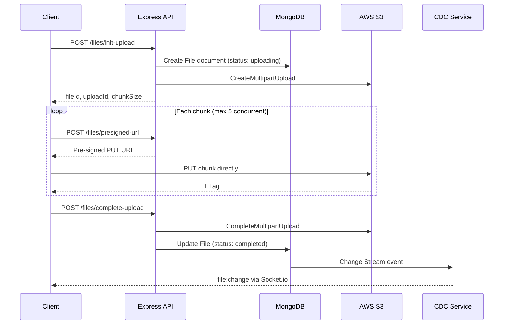
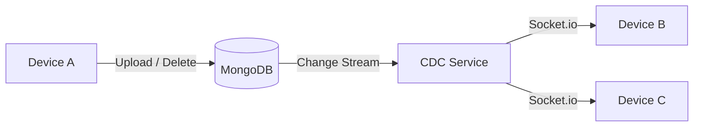

# File Sync App


Full-stack file sync with direct-to-S3 uploads, MongoDB CDC, and resumable multipart transfers. The API coordinates metadata only — clients handle compression, chunking, and upload orchestration.

---

## Highlights

- **Direct-to-S3 multipart uploads** — Clients upload 5 MB chunks via pre-signed URLs; the server only coordinates metadata, keeping bandwidth off the application tier.
- **MongoDB Change Streams (CDC)** — File mutations propagate to all connected devices over Socket.io without polling or custom pub/sub infrastructure.
- **Resumable uploads** — Per-chunk SHA-256 fingerprints let interrupted uploads skip already-transferred parts.
- **Client-side gzip compression** — Text-based files are compressed before upload to reduce storage and transfer cost.
- **Per-user storage quotas** — Enforced at upload init; usage tracked atomically on complete/delete.
- **Automated test suite** — 57 tests across unit, integration, and component layers (Vitest + Supertest + mongodb-memory-server).

---

## System Design

### Upload path



### Real-time sync



When a file is created, updated, or deleted, MongoDB emits a change event. The CDC service resolves the file owner and shared recipients, then broadcasts sanitized metadata to every active socket for those users. Delete events use a metadata cache so broadcasts work even after the document is gone.

### Design decisions

| Decision | Rationale |
|----------|-----------|
| Pre-signed URLs for chunk upload | Keeps the API stateless for data transfer; scales upload throughput independently of server capacity |
| Change Streams over application-level events | Single source of truth — any write to MongoDB (API, admin script, migration) triggers sync automatically |
| Chunk fingerprinting | Enables resume after network failure without re-uploading unchanged parts |
| HTTP-only JWT cookies | Tokens not exposed to client-side JS; Socket.io auth reuses the same cookie on handshake |
| `USE_LOCAL_STORAGE` dev mode | Full upload/download flow works without AWS credentials for local development and CI |
| Express app extracted from server bootstrap | Routes testable via Supertest without starting Socket.io or CDC |

---

## Tech Stack

| Layer | Technologies |
|-------|-------------|
| **Frontend** | React 18, Vite, Zustand, React Router, Axios, Socket.io Client, Pako (gzip) |
| **Backend** | Node.js, Express, Mongoose, Socket.io, AWS SDK v3, bcrypt, JWT |
| **Storage** | AWS S3 (multipart) or local filesystem (dev) |
| **Database** | MongoDB (replica set for Change Streams) |
| **Testing** | Vitest, Supertest, React Testing Library, mongodb-memory-server |

---

## Features

**Authentication** — Register/login with bcrypt-hashed passwords; JWT stored in HTTP-only cookies; protected routes and Socket.io handshake.

**File management** — Drag-and-drop upload, paginated file listing, pre-signed download URLs, soft-delete with storage reclamation.

**Sharing** — Share files with other registered users by email; recipients see shared files in a dedicated tab with download access.

**Upload pipeline** — 5 MB chunking, parallel uploads (concurrency limit of 5), progress tracking, gzip for text MIME types, SHA-256 file and chunk hashing.

**Real-time sync** — Multi-tab and multi-device UI updates on upload, delete, and share events via CDC + WebSockets.

---

## Testing

```bash
cd server && npm test   # 36 tests — auth middleware, User model, auth/files routes, CDC service
cd client && npm test   # 21 tests — fileUtils, authStore, Login component
```

Server integration tests run against an in-memory MongoDB instance — no external services required. Local storage mode is enabled automatically in the test environment.

---

## Getting Started

### Prerequisites

- Node.js 18+
- MongoDB running as a **replica set** (required for Change Streams)

### Setup

```bash
# Install dependencies
cd server && npm install
cd ../client && npm install

<<<<<<< HEAD
- File versioning and history
- Folder support
- Conflict resolution UI
=======
# Configure environment
cp .env.example .env
# Set MONGODB_URI, JWT_SECRET, and either AWS credentials or USE_LOCAL_STORAGE=true
```

**MongoDB replica set (local):**

```bash
mongod --replSet rs0 --port 27017 --dbpath /data/db
mongosh --eval "rs.initiate()"
```

**Environment variables** (see `.env.example`):

| Variable | Purpose |
|----------|---------|
| `MONGODB_URI` | MongoDB connection string with `?replicaSet=rs0` |
| `JWT_SECRET` | Signing key for auth tokens |
| `USE_LOCAL_STORAGE` | `true` to skip AWS and store files on disk |
| `AWS_*` / `S3_BUCKET_NAME` | Required when `USE_LOCAL_STORAGE` is not set |
| `CLIENT_URL` | Frontend origin for CORS (default `http://localhost:5173`) |

### Run

```bash
# Terminal 1 — API + CDC + WebSocket server
cd server && npm run dev

# Terminal 2 — React frontend (proxies /api and /socket.io)
cd client && npm run dev
```

- Frontend: http://localhost:5173
- API health check: http://localhost:5000/health

### Quick verification

1. Register and log in at `/register`
2. Upload a file — watch progress bar and storage quota update
3. Open a second browser window with the same account — file appears without refresh
4. Delete in one window — disappears in the other

---

## API Overview

| Method | Endpoint | Description |
|--------|----------|-------------|
| `POST` | `/api/auth/register` | Create account |
| `POST` | `/api/auth/login` | Authenticate |
| `GET` | `/api/auth/me` | Current user + storage usage |
| `POST` | `/api/files/init-upload` | Start multipart upload session |
| `POST` | `/api/files/presigned-url` | Get chunk upload URL |
| `POST` | `/api/files/complete-upload` | Finalize upload, trigger CDC |
| `GET` | `/api/files` | List owned files (paginated) |
| `GET` | `/api/files/shared` | List files shared with user |
| `GET` | `/api/files/:id/download` | Get download URL |
| `POST` | `/api/files/:id/share` | Share file with user by email |
| `DELETE` | `/api/files/:id` | Delete file and reclaim storage |

---

## Project Structure

```
FileShareApp/
├── client/
│   ├── src/
│   │   ├── components/     # Auth, FileManager (upload, list, share, sync indicator)
│   │   ├── services/       # API client, Socket.io sync service
│   │   ├── stores/         # Zustand auth state
│   │   └── utils/          # Chunking, hashing, formatting
│   └── tests/
├── server/
│   ├── app.js              # Express app factory (testable)
│   ├── server.js           # HTTP + Socket.io + CDC bootstrap
│   ├── routes/             # Auth and file endpoints
│   ├── services/           # CDC change stream handler
│   ├── models/             # User, File (Mongoose)
│   ├── middleware/         # JWT authentication
│   └── tests/
└── .env.example
```

---
>>>>>>> 0eacac5 (chore: update .gitignore, enhance README, and add testing scripts for client and server)
